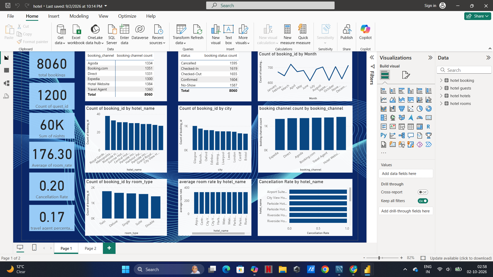

# Hotel Data Analysis — SQL & Power BI

## Project Overview

This project analyses hotel booking data using SQL and Power BI.

The project focuses on data cleaning, analysis, and dashboard development to understand booking patterns, guest behaviour, cancellations, room types, and booking channels.

## Tools Used

- MySQL
- SQL
- Power BI

## Project Workflow

1. Imported the hotel booking dataset
2. Cleaned and prepared the data using SQL
3. Performed exploratory analysis using SQL queries
4. Built KPIs and visualisations in Power BI
5. Created an interactive dashboard to analyse hotel booking performance

## Power BI Dashboard

## Dashboard Analysis

The dashboard provides insights into:

- Total bookings
- Total guests
- Total nights
- Average room rate
- Cancellation rate
- Travel agent bookings
- Monthly booking trends
- Booking channels
- Hotel performance
- City distribution
- Room types
- Cancellation rates by hotel

## Files

| File | Description |
|---|---|
| `hotel_database.sql` | SQL queries used for data cleaning and analysis |
| `hotel.pbix` | Power BI dashboard file |
| `hotel.pdf` | PDF export of the Power BI dashboard |
| `hotel-dashboard.png` | Dashboard preview |

## Key Skills Demonstrated

- SQL data cleaning
- Data transformation
- Exploratory data analysis
- KPI development
- Data visualisation
- Power BI dashboard development
- Business-oriented data analysis
